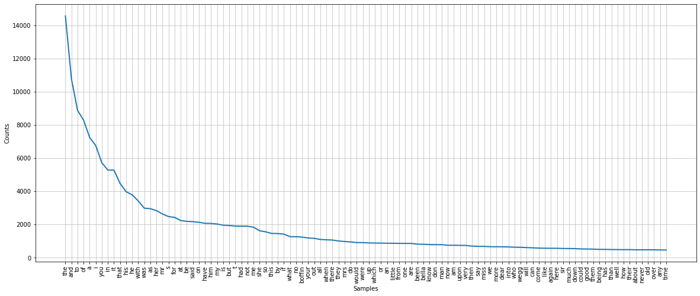
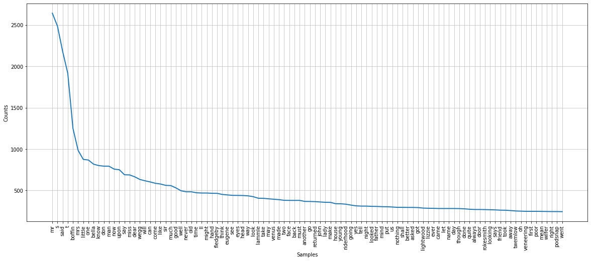

### 1. Importing Dataset

We are going to load a dataset, Charles Dickens's *Our Mutual Friend*, in Colab. In order to load a dataset, you must connect to Google Drive. If you run this code on your local server, skip connecting to Google Drive and load the dataset with the changed directory.


```python
from google.colab import drive
drive.mount('/content/drive/')
```

    Mounted at /content/drive/


```python
omf = open('drive/My Drive/Colab Notebooks/Tutorials/TopicModeling/Dataset/OMF.txt').read()
```


```python
print(omf[:50])
```

    In these times of ours, though concerning the exac


### 2. Tokenize the dataset


```python
import nltk
nltk.download('punkt')
```

    [nltk_data] Downloading package punkt to /root/nltk_data...
    [nltk_data]   Unzipping tokenizers/punkt.zip.


    True


```python
from nltk.tokenize import RegexpTokenizer

tokenizer = RegexpTokenizer(r'\w+')
tokenizer.tokenize('Eighty-seven miles to go, yet.  Onward!')
```


    ['Eighty', 'seven', 'miles', 'to', 'go', 'yet', 'Onward']


```python
tokens = tokenizer.tokenize(omf)
#tokens = nltk.word_tokenize(omf)
text = nltk.Text(tokens)
```


```python
len(text)
```


    332569


```python
print(text[:10])
```

    ['In', 'these', 'times', 'of', 'ours', 'though', 'concerning', 'the', 'exact', 'year']


### 3. `concordance`, `similar`, `common_contexts`, and `dispersion_plot`

`concordance` shows every occurrence of a word within context.


```python
text.concordance("Harmon")
```

    Displaying 25 of 123 matches:
     on addressing Eugene whose name is Harmon was only son of a tremendous old ra
    utter stranger Are you seeking a Mr Harmon No Then I believe I can assure you 
    es under which the deceased Mr John Harmon had returned to England exclusive p
    passenger that the deceased Mr John Harmon did bring over in a hand valise wit
    Jury found That the body of Mr John Harmon had been discovered floating in the
    h injured and that the said Mr John Harmon had come by his death under highly 
    n borne to the knowledge of men the Harmon Murder as it came to be popularly c
    And if the truth was known when the Harmon murder was all over the town and pe
    ing her favourite ankle when old Mr Harmon made such a fool of me not to menti
    had much perplexed Why yer mean Old Harmon s do yer said the hoarse gentleman 
     yer hi on his ears cut away to Old Harmon s Edward instantly pricked up his e
     giv it the name on accounts of Old Harmon living solitary there And why did t
    ith nobody Like a speeches of chaff Harmon s Jail Harmony Jail Working it roun
     Abbey It was on the night when the Harmon murder was found out through father
    t an appointment It s time I was at Harmon s Eh said Mr Venus Harmon s up Batt
     I was at Harmon s Eh said Mr Venus Harmon s up Battle Bridge way Mr Wegg admi
    g legal and at an iron box labelled HARMON ESTATE until Mr Lightwood appeared 
    een at length complied with will of Harmon deceased having been proved death o
    eceased having been proved death of Harmon next inheriting having been proved 
    had recalled as appertaining to the Harmon property And he was still jogging a
    er say when you inquire of him it s Harmon s will you Harmoon s repeated Mr Ro
    esence of mind that s YOUR look out Harmon s is all you ve got to say to HIM M
    fancy You remember dear little John Harmon before he went to school Over yonde
     I hope I shall have my little John Harmon to show you Mr Rokesmith who was at
     had prospered exceedingly upon the Harmon Murder and had turned the social di


I searched `Harmon` and it has 121 matches. It only shows 25 out of the 121 results. Let's use a `lines` parameter to list all of the results.


```python
text.concordance("Harmon", lines=10)
```

    Displaying 10 of 123 matches:
     on addressing Eugene whose name is Harmon was only son of a tremendous old ra
    utter stranger Are you seeking a Mr Harmon No Then I believe I can assure you 
    es under which the deceased Mr John Harmon had returned to England exclusive p
    passenger that the deceased Mr John Harmon did bring over in a hand valise wit
    Jury found That the body of Mr John Harmon had been discovered floating in the
    h injured and that the said Mr John Harmon had come by his death under highly 
    n borne to the knowledge of men the Harmon Murder as it came to be popularly c
    And if the truth was known when the Harmon murder was all over the town and pe
    ing her favourite ankle when old Mr Harmon made such a fool of me not to menti
    had much perplexed Why yer mean Old Harmon s do yer said the hoarse gentleman 


Let's try the `similar` function to see other words in a similar range of contexts.


```python
text.similar("Harmon")
```

    rokesmith boffin wegg dear it twemlow lightwood lammle fledgeby riah
    that venus headstone and wrayburn wilfer riderhood the on he


`rokesmith` appears first. Let's see the results for `rokesmith` using the `concordance` function.


```python
text.concordance("rokesmith")
```

    Displaying 25 of 268 matches:
    ing parties were R Wilfer and John Rokesmith Esquire When it came to Bella s tu
    o Bella s turn to sign her name Mr Rokesmith who was standing as he had sat wit
    is furniture and himself and go Mr Rokesmith did that as awkwardly as it might 
    stions Pa mark my words Between Mr Rokesmith and me there is a natural antipath
    id the cherub patriarch between Mr Rokesmith and me there is a matter of eight 
    ss Meantime her father chinking Mr Rokesmith s gold as he sat expectant between
    one in their room we shall have Mr Rokesmith here and shall be expecting to hav
     a twin brother upon earth Mr John Rokesmith was the man Over against a London 
    e not mentioned my name My name is Rokesmith I lodge at one Mr Wilfer s at Holl
    say to you Say nothing returned Mr Rokesmith allow me to call on you in a few d
    r I am in some sort anticipated Mr Rokesmith answered evidently having heard it
    ies seemed by no means clear to Mr Rokesmith s astonished comprehension Mr Boff
    n s will you Harmoon s repeated Mr Rokesmith seeming to have caught the sound i
    tual Friend now Do you like him Mr Rokesmith is very punctual very quiet a very
    od account of him Is he at home Mr Rokesmith is at home said Mrs Wilfer indeed 
    id Mr Boffin This is Mrs Boffin Mr Rokesmith that I told you of my dear She gav
     little John Harmon to show you Mr Rokesmith who was at the wheel adjusting the
     you show her the Dead returned Mr Rokesmith It s only an adopted child One I h
    to You took me by surprise said Mr Rokesmith and it sounded like an omen that y
    lla suspected by this time that Mr Rokesmith admired her Whether the knowledge 
     by the hammer headed young man Mr Rokesmith Oh said Mr Boffin Oh indeed Our an
     my dear Yes Ask him to come in Mr Rokesmith appeared Sit down sir said Mr Boff
    e can talk it over now can t us Mr Rokesmith bowed thanked her and said he hope
     t it I said Secretary assented Mr Rokesmith It rather puzzled me at the time s
    y ain t THAT Certainly not said Mr Rokesmith But he had used the word in the se


```python
text.common_contexts(["Harmon", "Rokesmith"])
```

    john_to john_s john_was john_is mr_i john_as john_shall john_who
    john_being mr_said mr_s mr_when john_and john_would mr_is mr_whether
    john_in


```python
text.dispersion_plot(["Harmon", "Rokesmith", "Boffin", "Bella"])
```


    

    


The figure size is a little small. We can customize the size with `matplotlib`


```python
import matplotlib.pyplot as plt
plt.figure(figsize=(20, 8))  # (width, height)

text.dispersion_plot(["Harmon", "Rokesmith", "Boffin", "Bella"])
```


    

    


### 4. Counting Words


```python
len(text)
```


    332569


```python
len(set(text))
```


    16747


Although *Our Mutual Friend* has 397,004 tokens, it only has 18,741 distict words. The number includes stop words and punctuation.

To see the lexical richness of the novel, we can calculate the average usage of each word.


```python
from __future__ import division

len(text) / len(set(text))
```


    19.85842240401266


This means each word was used around 21 times on average in *Our Mutual Friend*.

Let's play with specific words: 'money' which is one of the most important themes, and 'London'.


```python
text.count('money')
```


    231


```python
text.count('London')
```


    65


```python
100*text.count('money')/len(text)
```


    0.06945927010635387


```python
100*text.count('London')/len(text)
```


    0.019544816263692647


```python
def word_diversity(text):
  return len(text) / len(set(text))

def percentage(count, total):
  return 100*count/total
```


```python
word_diversity(text)
```


    19.85842240401266


```python
percentage(text.count('money'), len(text))
```


    0.06945927010635387


## 5. `index`, `join`, and `split`


```python
text[1000]
```


    'I'


```python
text.index('pocket')
```


    883


```python
text[1000:1020]
```


    ['I',
     'cannot',
     'bear',
     'it',
     'It',
     's',
     'my',
     'belief',
     'you',
     'hate',
     'the',
     'sight',
     'of',
     'the',
     'very',
     'river',
     'I',
     'I',
     'do',
     'not']


```python
['Harmon', 'Boffin', 'Bella']
```


    ['Harmon', 'Boffin', 'Bella']


```python
a = ['Harmon', 'Boffin', 'Bella']
b = ['money']
```


```python
a
```


    ['Harmon', 'Boffin', 'Bella']


```python
a+b
```


    ['Harmon', 'Boffin', 'Bella', 'money']


```python
''.join(a)
```


    'HarmonBoffinBella'


```python
'Howdy Aggies'.split()
```


    ['Howdy', 'Aggies']


```python
first_sentence = "In these times of ours, though concerning the exact year there is no need to be precise, a boat of dirty and disreputable appearance, with two figures in it, floated on the Thames, between Southwark bridge which is of iron, and London Bridge which is of stone, as an autumn evening was closing in."
```


```python
first_sentence.split()
```


    ['In',
     'these',
     'times',
     'of',
     'ours,',
     'though',
     'concerning',
     'the',
     'exact',
     'year',
     'there',
     'is',
     'no',
     'need',
     'to',
     'be',
     'precise,',
     'a',
     'boat',
     'of',
     'dirty',
     'and',
     'disreputable',
     'appearance,',
     'with',
     'two',
     'figures',
     'in',
     'it,',
     'floated',
     'on',
     'the',
     'Thames,',
     'between',
     'Southwark',
     'bridge',
     'which',
     'is',
     'of',
     'iron,',
     'and',
     'London',
     'Bridge',
     'which',
     'is',
     'of',
     'stone,',
     'as',
     'an',
     'autumn',
     'evening',
     'was',
     'closing',
     'in.']


```python
first_sentence.split(',')
```


    ['In these times of ours',
     ' though concerning the exact year there is no need to be precise',
     ' a boat of dirty and disreputable appearance',
     ' with two figures in it',
     ' floated on the Thames',
     ' between Southwark bridge which is of iron',
     ' and London Bridge which is of stone',
     ' as an autumn evening was closing in.']


## 6. Word Frequencies


```python
set(first_sentence)
```


    {' ',
     ',',
     '.',
     'B',
     'I',
     'L',
     'S',
     'T',
     'a',
     'b',
     'c',
     'd',
     'e',
     'f',
     'g',
     'h',
     'i',
     'k',
     'l',
     'm',
     'n',
     'o',
     'p',
     'r',
     's',
     't',
     'u',
     'v',
     'w',
     'x',
     'y'}


```python
tokenized_sentence = nltk.word_tokenize(first_sentence)
tokenized_sentence = nltk.Text(tokenized_sentence)
```


```python
lowercase_sentence = [word.lower() for word in tokenized_sentence]
```


```python
set(lowercase_sentence)
```


    {',',
     '.',
     'a',
     'an',
     'and',
     'appearance',
     'as',
     'autumn',
     'be',
     'between',
     'boat',
     'bridge',
     'closing',
     'concerning',
     'dirty',
     'disreputable',
     'evening',
     'exact',
     'figures',
     'floated',
     'in',
     'iron',
     'is',
     'it',
     'london',
     'need',
     'no',
     'of',
     'on',
     'ours',
     'precise',
     'southwark',
     'stone',
     'thames',
     'the',
     'there',
     'these',
     'though',
     'times',
     'to',
     'two',
     'was',
     'which',
     'with',
     'year'}


```python
test = set(lowercase_sentence)
test = sorted(test)
```


```python
test[-3:]
```


    ['which', 'with', 'year']


Let's use the `FreqDist` function to perfom word frequencies. 


```python
lowercase_text = [word.lower() for word in text]
```


```python
from nltk import FreqDist
c = FreqDist(lowercase_text)
```


```python
print(c)
```

    <FreqDist with 14893 samples and 332569 outcomes>


```python
c.most_common(30)
```


    [('the', 14583),
     ('and', 10781),
     ('to', 8893),
     ('of', 8296),
     ('a', 7254),
     ('i', 6768),
     ('you', 5733),
     ('in', 5289),
     ('it', 5288),
     ('that', 4491),
     ('his', 3986),
     ('he', 3799),
     ('with', 3430),
     ('was', 2993),
     ('as', 2961),
     ('her', 2845),
     ('mr', 2642),
     ('s', 2484),
     ('for', 2438),
     ('at', 2245),
     ('be', 2197),
     ('said', 2180),
     ('on', 2142),
     ('have', 2079),
     ('him', 2073),
     ('my', 2037),
     ('is', 1966),
     ('but', 1947),
     ('t', 1913),
     ('had', 1910)]


```python
c['boffin']
```


    1250


```python
c.plot(50, cumulative=True)
```


    

    


```python
plt.figure(figsize=(20, 8))  # (width, height)

c.plot(100, cumulative=False)
```


    

    


```python
# Words that only appear once
# c.hapaxes()
```

## 7. Stopwords

Let's remove stopwords from the corpus, and then perform a word frequency task.


```python
!pip install stop_words
```

    Collecting stop_words
      Downloading https://files.pythonhosted.org/packages/1c/cb/d58290804b7a4c5daa42abbbe2a93c477ae53e45541b1825e86f0dfaaf63/stop-words-2018.7.23.tar.gz
    Building wheels for collected packages: stop-words
      Building wheel for stop-words (setup.py) ... [?25l[?25hdone
      Created wheel for stop-words: filename=stop_words-2018.7.23-cp37-none-any.whl size=32917 sha256=5cdb2c163bef836298ffa030089073ef56829df06f4260c3591d14472c1c0a2f
      Stored in directory: /root/.cache/pip/wheels/75/37/6a/2b295e03bd07290f0da95c3adb9a74ba95fbc333aa8b0c7c78
    Successfully built stop-words
    Installing collected packages: stop-words
    Successfully installed stop-words-2018.7.23


```python
from stop_words import get_stop_words
```


```python
stop_words = list(get_stop_words('en'))         #About 900 stopwords
```


```python
print(stop_words[:10])
```

    ['a', 'about', 'above', 'after', 'again', 'against', 'all', 'am', 'an', 'and']


```python
text_stopwords = [word for word in lowercase_text if word not in stop_words]
```


```python
print(text_stopwords[:10])
```

    ['times', 'though', 'concerning', 'exact', 'year', 'need', 'precise', 'boat', 'dirty', 'disreputable']


```python
d = FreqDist(text_stopwords)
```


```python
print(d)
```

    <FreqDist with 14769 samples and 162586 outcomes>


```python
d.most_common(30)
```


    [('mr', 2642),
     ('s', 2484),
     ('said', 2180),
     ('t', 1913),
     ('boffin', 1250),
     ('mrs', 984),
     ('little', 875),
     ('one', 867),
     ('bella', 817),
     ('know', 800),
     ('don', 793),
     ('man', 792),
     ('now', 757),
     ('upon', 750),
     ('say', 689),
     ('miss', 687),
     ('dear', 664),
     ('wegg', 632),
     ('will', 616),
     ('can', 602),
     ('come', 586),
     ('like', 577),
     ('sir', 561),
     ('much', 558),
     ('good', 530),
     ('well', 495),
     ('never', 483),
     ('old', 483),
     ('time', 471),
     ('ll', 468)]


```python
d['boffin']
```


    1250


```python
d.plot(50, cumulative=True)
```


    

    


```python
plt.figure(figsize=(20, 8))  # (width, height)

d.plot(100, cumulative=False)
```


    

    

