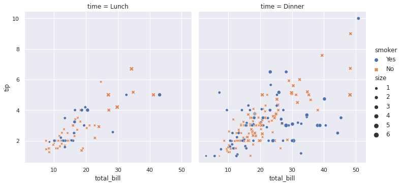
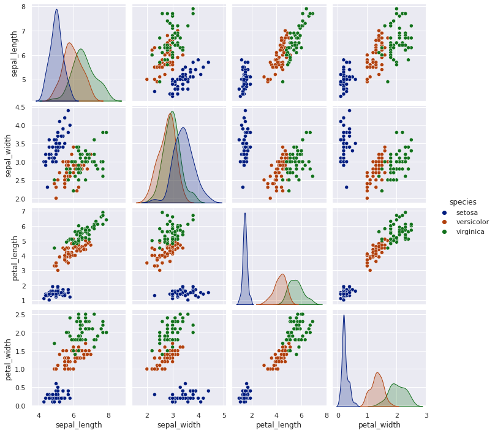
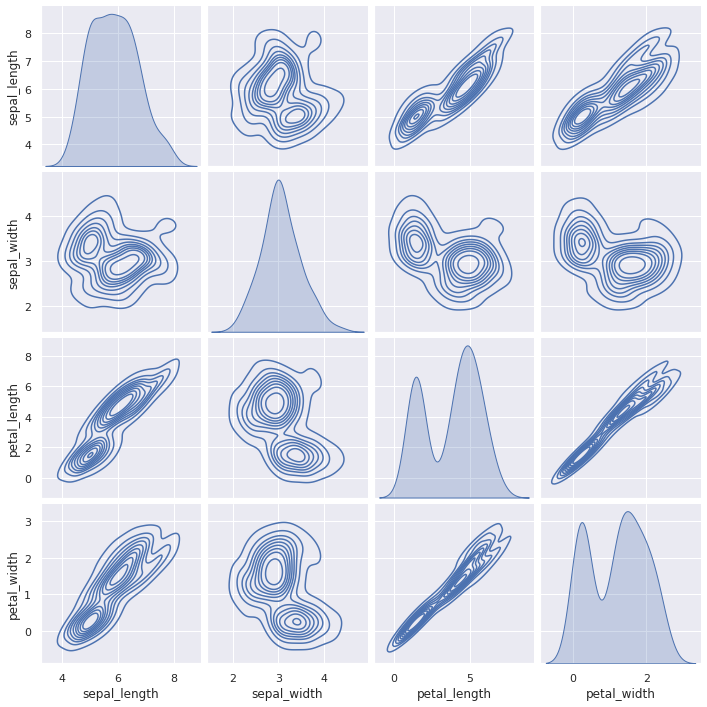

# Introduction to Seaborn

`seaborn` builds on top of `Matplotlib`, and it is mostly deployed with `pandas`.


```python
import seaborn as sns
```


```python
sns.__version__
```


    '0.11.0'


```python
sns.set()
sns.set_style('darkgrid')
sns.set_color_codes()
```


```python
current_palette = sns.color_palette()
sns.palplot(current_palette)
```


Load the `tips` dataset, which included in `Seaborn`.


```python
tips = sns.load_dataset("tips")
```


```python
tips.head(10)
```


<div>
<style scoped>
    .dataframe tbody tr th:only-of-type {
        vertical-align: middle;
    }

    .dataframe tbody tr th {
        vertical-align: top;
    }

    .dataframe thead th {
        text-align: right;
    }
</style>
<table border="1" class="dataframe">
  <thead>
    <tr style="text-align: right;">
      <th></th>
      <th>total_bill</th>
      <th>tip</th>
      <th>sex</th>
      <th>smoker</th>
      <th>day</th>
      <th>time</th>
      <th>size</th>
    </tr>
  </thead>
  <tbody>
    <tr>
      <th>0</th>
      <td>16.99</td>
      <td>1.01</td>
      <td>Female</td>
      <td>No</td>
      <td>Sun</td>
      <td>Dinner</td>
      <td>2</td>
    </tr>
    <tr>
      <th>1</th>
      <td>10.34</td>
      <td>1.66</td>
      <td>Male</td>
      <td>No</td>
      <td>Sun</td>
      <td>Dinner</td>
      <td>3</td>
    </tr>
    <tr>
      <th>2</th>
      <td>21.01</td>
      <td>3.50</td>
      <td>Male</td>
      <td>No</td>
      <td>Sun</td>
      <td>Dinner</td>
      <td>3</td>
    </tr>
    <tr>
      <th>3</th>
      <td>23.68</td>
      <td>3.31</td>
      <td>Male</td>
      <td>No</td>
      <td>Sun</td>
      <td>Dinner</td>
      <td>2</td>
    </tr>
    <tr>
      <th>4</th>
      <td>24.59</td>
      <td>3.61</td>
      <td>Female</td>
      <td>No</td>
      <td>Sun</td>
      <td>Dinner</td>
      <td>4</td>
    </tr>
    <tr>
      <th>5</th>
      <td>25.29</td>
      <td>4.71</td>
      <td>Male</td>
      <td>No</td>
      <td>Sun</td>
      <td>Dinner</td>
      <td>4</td>
    </tr>
    <tr>
      <th>6</th>
      <td>8.77</td>
      <td>2.00</td>
      <td>Male</td>
      <td>No</td>
      <td>Sun</td>
      <td>Dinner</td>
      <td>2</td>
    </tr>
    <tr>
      <th>7</th>
      <td>26.88</td>
      <td>3.12</td>
      <td>Male</td>
      <td>No</td>
      <td>Sun</td>
      <td>Dinner</td>
      <td>4</td>
    </tr>
    <tr>
      <th>8</th>
      <td>15.04</td>
      <td>1.96</td>
      <td>Male</td>
      <td>No</td>
      <td>Sun</td>
      <td>Dinner</td>
      <td>2</td>
    </tr>
    <tr>
      <th>9</th>
      <td>14.78</td>
      <td>3.23</td>
      <td>Male</td>
      <td>No</td>
      <td>Sun</td>
      <td>Dinner</td>
      <td>2</td>
    </tr>
  </tbody>
</table>
</div>


Let's visualize the data using `relplot`.


```python
sns.relplot(
    data=tips,
    x="total_bill", y="tip",
    hue="smoker", style="smoker"
)
```


    <seaborn.axisgrid.FacetGrid at 0x7fce7dbef470>


```python
sns.relplot(
    data=tips,
    x="total_bill", y="tip", col="time",
    hue="smoker", style="smoker", size="size",
)
```


    <seaborn.axisgrid.FacetGrid at 0x7fce7dbdc588>





```python
dots = sns.load_dataset("dots")
```


```python
sns.relplot(
    data=dots, kind="line",
    x="time", y="firing_rate", col="align",
    hue="choice", size="coherence", style="choice",
    facet_kws=dict(sharex=False),
)
```


    <seaborn.axisgrid.FacetGrid at 0x7fce79fb2358>


Let's visualize the dataset using `catplot`.


```python
sns.catplot(x='day', y='total_bill', hue='smoker',
            col='time', aspect=.6,
            kind='swarm', data=tips)
```


    <seaborn.axisgrid.FacetGrid at 0x7fce79ec3a20>


We can play with the `Titanic` dataset, which is already included in `Seaborn`.


```python
titanic = sns.load_dataset('titanic')
```


```python
t = sns.catplot(x='fare', y='survived', row='class', 
                kind='box', orient='h', height=1.5, aspect=4, 
                data=titanic.query('fare > 0'))
t.set(xscale='log');
```


Let's visualize the `Iris` data using `pairplot`. The Iris dataset is already included in `Seaborn`.


```python
iris = sns.load_dataset('iris')
```


```python
sns.pairplot(iris, hue = 'species')
```


    <seaborn.axisgrid.PairGrid at 0x7fce7dbc4d30>


Maybe we can change the color?


```python
# Reference for color: https://seaborn.pydata.org/tutorial/color_palettes.html

sns.pairplot(iris, hue = 'species', palette='dark')
```


    <seaborn.axisgrid.PairGrid at 0x7fce77d04748>





```python
sns.pairplot(iris, kind='kde')
```


    <seaborn.axisgrid.PairGrid at 0x7fce7777d390>





```python
sns.pairplot(iris, kind='hist')
```


    <seaborn.axisgrid.PairGrid at 0x7fce88e085c0>


Let's visualize the `flights` dataset using `heatmap`. We will also use `matplotlib`.


```python
from matplotlib import pyplot as plt
```


```python
flights = sns.load_dataset('flights')
flights = flights.pivot('month', 'year', 'passengers')
plt.figure(figsize=(15, 15))
ax = sns.heatmap(flights, annot=True, fmt='d')
```


References
- "[seaborn: statistical data visualization](https://seaborn.pydata.org/index.html)"


[](https://creativecommons.org/licenses/by-nc/4.0/)