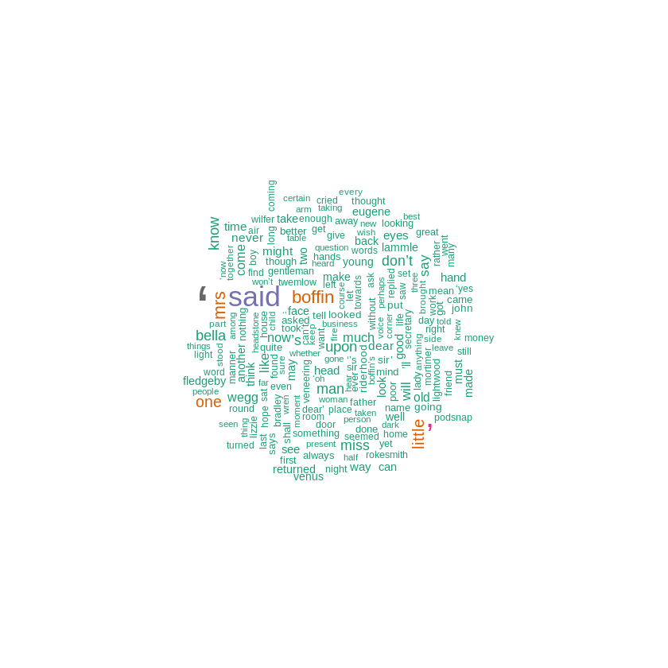

# Create a Word Cloud with Word Frequencies


```R
install.packages("tm")  # for text mining
install.packages("SnowballC") # for text stemming
install.packages("wordcloud") # word-cloud generator 
install.packages("RColorBrewer") # color palettes
```

    Installing package into ‘/usr/local/lib/R/site-library’
    (as ‘lib’ is unspecified)
    
    also installing the dependencies ‘NLP’, ‘slam’
    
    
    Installing package into ‘/usr/local/lib/R/site-library’
    (as ‘lib’ is unspecified)
    
    Installing package into ‘/usr/local/lib/R/site-library’
    (as ‘lib’ is unspecified)
    
    Installing package into ‘/usr/local/lib/R/site-library’
    (as ‘lib’ is unspecified)
    
    


```R
library("tm")
library("SnowballC")
library("wordcloud")
library("RColorBrewer")
```

    Loading required package: NLP
    
    Loading required package: RColorBrewer
    
    

Let's find where is the working directory by using the `getwd` function.


```R
getwd()
```


'/content'


```R
# Change the URL
omf <- readLines("OMF.txt", encoding="utf-8")
```

    Warning message in readLines("/content/OMF.txt"):
    “incomplete final line found on '/content/OMF.txt'”
    


```R
# Load the data as a corpus
docs <- Corpus(VectorSource(omf))
```


```R
inspect(docs)
```

    IOPub data rate exceeded.
    The notebook server will temporarily stop sending output
    to the client in order to avoid crashing it.
    To change this limit, set the config variable
    `--NotebookApp.iopub_data_rate_limit`.
    
    Current values:
    NotebookApp.iopub_data_rate_limit=1000000.0 (bytes/sec)
    NotebookApp.rate_limit_window=3.0 (secs)
    
    


```R
toSpace <- content_transformer(function (x , pattern ) gsub(pattern, " ", x))
docs <- tm_map(docs, toSpace, "/")
docs <- tm_map(docs, toSpace, "@")
docs <- tm_map(docs, toSpace, "\\|")
```

    Warning message in tm_map.SimpleCorpus(docs, toSpace, "/"):
    “transformation drops documents”
    Warning message in tm_map.SimpleCorpus(docs, toSpace, "@"):
    “transformation drops documents”
    Warning message in tm_map.SimpleCorpus(docs, toSpace, "\\|"):
    “transformation drops documents”
    

We need to curate the data. I didn't use text stemming, but included code for it.


```R
# Convert the text to lower case
docs <- tm_map(docs, content_transformer(tolower))
# Remove numbers
docs <- tm_map(docs, removeNumbers)
# Remove english common stopwords
docs <- tm_map(docs, removeWords, stopwords("english"))
# Remove your own stop word
# specify your stopwords as a character vector
docs <- tm_map(docs, removeWords, c("blabla1", "blabla2")) 
# Remove punctuations
docs <- tm_map(docs, removePunctuation)
# Eliminate extra white spaces
docs <- tm_map(docs, stripWhitespace)
# Text stemming
# docs <- tm_map(docs, stemDocument)
```

    Warning message in tm_map.SimpleCorpus(docs, content_transformer(tolower)):
    “transformation drops documents”
    Warning message in tm_map.SimpleCorpus(docs, removeNumbers):
    “transformation drops documents”
    Warning message in tm_map.SimpleCorpus(docs, removeWords, stopwords("english")):
    “transformation drops documents”
    Warning message in tm_map.SimpleCorpus(docs, removeWords, c("blabla1", "blabla2")):
    “transformation drops documents”
    Warning message in tm_map.SimpleCorpus(docs, removePunctuation):
    “transformation drops documents”
    Warning message in tm_map.SimpleCorpus(docs, stripWhitespace):
    “transformation drops documents”
    

Through the `sort` function, you can sort the data with decreasing or increasing orders. The data need to be organized as a frame to be processed for a word frequency task.


```R
dtm <- TermDocumentMatrix(docs)
m <- as.matrix(dtm)
v <- sort(rowSums(m),decreasing=TRUE)
d <- data.frame(word = names(v),freq=v)
```


```R
head(d, 10)
```


<table>
<caption>A data.frame: 10 × 2</caption>
<thead>
	<tr><th></th><th scope=col>word</th><th scope=col>freq</th></tr>
	<tr><th></th><th scope=col>&lt;chr&gt;</th><th scope=col>&lt;dbl&gt;</th></tr>
</thead>
<tbody>
	<tr><th scope=row>‘</th><td>‘     </td><td>5892</td></tr>
	<tr><th scope=row>’</th><td>’     </td><td>2587</td></tr>
	<tr><th scope=row>said</th><td>said  </td><td>2169</td></tr>
	<tr><th scope=row>boffin</th><td>boffin</td><td>1035</td></tr>
	<tr><th scope=row>mrs</th><td>mrs   </td><td> 971</td></tr>
	<tr><th scope=row>little</th><td>little</td><td> 872</td></tr>
	<tr><th scope=row>one</th><td>one   </td><td> 797</td></tr>
	<tr><th scope=row>upon</th><td>upon  </td><td> 732</td></tr>
	<tr><th scope=row>know</th><td>know  </td><td> 715</td></tr>
	<tr><th scope=row>bella</th><td>bella </td><td> 705</td></tr>
</tbody>
</table>


Finally, everything is ready to be visualized. Let's make a word cloud of word frequencies. You can customize the visualization by changing parameters. 


```R
set.seed(1234)
wordcloud(words = d$word, freq = d$freq, min.freq = 5,
          max.words=200, random.order=TRUE, rot.per=0.35,
          colors=brewer.pal(8, "Dark2"))
```




