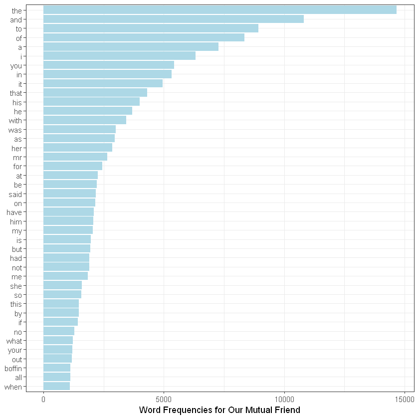
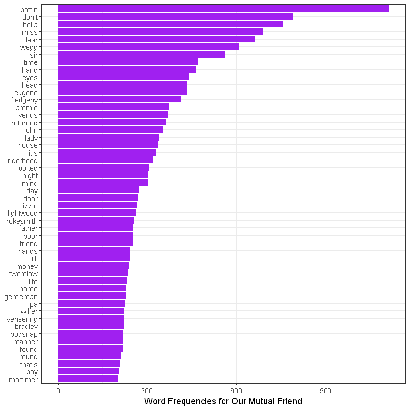

# Text Mining in R: Word Count Analysis

We are going to extract wordcounts from texts and visualize the results in R. Firstly, you need to install the `tidytext` and `readtext` packages.


```R
# Install packages
install.packages("tidytext")
install.packages("readtext")
install.packages("magrittr")
```

    Installing package into 'C:/Users/elibo/Documents/R/win-library/4.0'
    (as 'lib' is unspecified)
    
    

    package 'tidytext' successfully unpacked and MD5 sums checked
    
    The downloaded binary packages are in
    	C:\Users\elibo\AppData\Local\Temp\Rtmp2Fs3XH\downloaded_packages
    

    Installing package into 'C:/Users/elibo/Documents/R/win-library/4.0'
    (as 'lib' is unspecified)
    
    

    package 'readtext' successfully unpacked and MD5 sums checked
    
    The downloaded binary packages are in
    	C:\Users\elibo\AppData\Local\Temp\Rtmp2Fs3XH\downloaded_packages
    

    Installing package into 'C:/Users/elibo/Documents/R/win-library/4.0'
    (as 'lib' is unspecified)
    
    

    package 'magrittr' successfully unpacked and MD5 sums checked
    
    The downloaded binary packages are in
    	C:\Users\elibo\AppData\Local\Temp\Rtmp2Fs3XH\downloaded_packages
    


```R
# Load packages
library(tidytext)
library(readtext)
library(magrittr)
```

I will use Charles Dickens’ *Our Mutual Friend* for the word count analysis. I downloaded the txt file on Gutenberg (https://www.gutenberg.org/). Now, we need to load the text file into the R program.

Before loading files, we should find the working directory. Let's find where is the working directory by using the `getwd` function.


```R
getwd()
```


'C:/Users/elibo/Downloads'


Depending on the OS, the format of the file location is different. For Mac OS, the location begins with `~/` whereas in Windows, the location begins with `C:\` I have the txt file in `~/desktop/` In the readtext function, you need to put the location of the file.


```R
# Change the URL
omf <- readtext("OMF.txt", encoding="utf-8")
```

Let’s check the loaded file in R. Type `summary()` and the file name.


```R
summary(omf)
```


        doc_id              text          
     Length:1           Length:1          
     Class :character   Class :character  
     Mode  :character   Mode  :character  


## Tokenize the text file

Now, we need to tokenize the text file. We are going to use “unnest_tokens” included in the Tidytext package (from v.0.2.0). You can find specifics for the usage of the “unnest_tokens” in the following link: (https://www.rdocumentation.org/packages/tidytext/versions/0.2.0/topics/unnest_tokens)


```R
install.packages("tidyr")
```

    Installing package into 'C:/Users/elibo/Documents/R/win-library/4.0'
    (as 'lib' is unspecified)
    
    

    package 'tidyr' successfully unpacked and MD5 sums checked
    
    The downloaded binary packages are in
    	C:\Users\elibo\AppData\Local\Temp\Rtmp2Fs3XH\downloaded_packages
    


```R
library("tidyr")
```

    
    Attaching package: 'tidyr'
    
    
    The following object is masked from 'package:magrittr':
    
        extract
    
    
    

We can use the `unnest_tokens` function now. Let’s tokenize the text into words.

If you want to tokenize the text file into sentences, you should change the code a little bit in the following way: `unnest_tokens(sentence, text, token='sentences')`


```R
token_omf <- omf %>% 
unnest_tokens(word, text)
```

## Visualizing the Analysis of Frequent Words

We need to load the `ggplot2` package for visualization. The `ggplot2` package is mostly used to visualize texts in R. If you haven’t installed the package, you need to install it before loading.

In addition to the `ggplot2` package, we need to use the `dplyr` package in order to sort word frequencies.


```R
install.packages("ggplot2")
install.packages("dplyr")
```

    Installing package into 'C:/Users/elibo/Documents/R/win-library/4.0'
    (as 'lib' is unspecified)
    
    

    package 'ggplot2' successfully unpacked and MD5 sums checked
    
    The downloaded binary packages are in
    	C:\Users\elibo\AppData\Local\Temp\Rtmp2Fs3XH\downloaded_packages
    

    Installing package into 'C:/Users/elibo/Documents/R/win-library/4.0'
    (as 'lib' is unspecified)
    
    

    package 'dplyr' successfully unpacked and MD5 sums checked
    

    Warning message:
    "cannot remove prior installation of package 'dplyr'"
    Warning message in file.copy(savedcopy, lib, recursive = TRUE):
    "problem copying C:\Users\elibo\Documents\R\win-library\4.0\00LOCK\dplyr\libs\x64\dplyr.dll to C:\Users\elibo\Documents\R\win-library\4.0\dplyr\libs\x64\dplyr.dll: Permission denied"
    Warning message:
    "restored 'dplyr'"
    

    
    The downloaded binary packages are in
    	C:\Users\elibo\AppData\Local\Temp\Rtmp2Fs3XH\downloaded_packages
    


```R
library("ggplot2")
library("dplyr")
```

    
    Attaching package: 'dplyr'
    
    
    The following objects are masked from 'package:stats':
    
        filter, lag
    
    
    The following objects are masked from 'package:base':
    
        intersect, setdiff, setequal, union
    
    
    

Time to code for the analysis of frequent words!


```R
token_omf %>%
count(word, sort = TRUE) %>%
filter(n > 1000) %>%
mutate(word = reorder(word, n)) %>%
ggplot(aes(word, n)) +
geom_col(fill = "lightblue") +
xlab(NULL) +
coord_flip() +
theme_bw() +
labs(y = "Word Frequencies for Our Mutual Friend")
```


    

    


You can change the condition of the filter. I put (n>1000), which means words used more than 1000 times will appear in the analysis. Instead of “lightblue,” you can put other colors. If you type “colors()”, you can find color options. There are 657 colors! In the last line, I put the title.

Notice anything unusual? Most frequent words are stop words, such as “the,” “and,” and “to.” If you want to remove them, you need to remove stopwords from the `token_omf` file.


```R
data("stop_words")
```


```R
stop_words
```


<table>
<caption>A tibble: 1149 × 2</caption>
<thead>
	<tr><th scope=col>word</th><th scope=col>lexicon</th></tr>
	<tr><th scope=col>&lt;chr&gt;</th><th scope=col>&lt;chr&gt;</th></tr>
</thead>
<tbody>
	<tr><td>a          </td><td>SMART</td></tr>
	<tr><td>a's        </td><td>SMART</td></tr>
	<tr><td>able       </td><td>SMART</td></tr>
	<tr><td>about      </td><td>SMART</td></tr>
	<tr><td>above      </td><td>SMART</td></tr>
	<tr><td>according  </td><td>SMART</td></tr>
	<tr><td>accordingly</td><td>SMART</td></tr>
	<tr><td>across     </td><td>SMART</td></tr>
	<tr><td>actually   </td><td>SMART</td></tr>
	<tr><td>after      </td><td>SMART</td></tr>
	<tr><td>afterwards </td><td>SMART</td></tr>
	<tr><td>again      </td><td>SMART</td></tr>
	<tr><td>against    </td><td>SMART</td></tr>
	<tr><td>ain't      </td><td>SMART</td></tr>
	<tr><td>all        </td><td>SMART</td></tr>
	<tr><td>allow      </td><td>SMART</td></tr>
	<tr><td>allows     </td><td>SMART</td></tr>
	<tr><td>almost     </td><td>SMART</td></tr>
	<tr><td>alone      </td><td>SMART</td></tr>
	<tr><td>along      </td><td>SMART</td></tr>
	<tr><td>already    </td><td>SMART</td></tr>
	<tr><td>also       </td><td>SMART</td></tr>
	<tr><td>although   </td><td>SMART</td></tr>
	<tr><td>always     </td><td>SMART</td></tr>
	<tr><td>am         </td><td>SMART</td></tr>
	<tr><td>among      </td><td>SMART</td></tr>
	<tr><td>amongst    </td><td>SMART</td></tr>
	<tr><td>an         </td><td>SMART</td></tr>
	<tr><td>and        </td><td>SMART</td></tr>
	<tr><td>another    </td><td>SMART</td></tr>
	<tr><td>...</td><td>...</td></tr>
	<tr><td>went    </td><td>onix</td></tr>
	<tr><td>were    </td><td>onix</td></tr>
	<tr><td>what    </td><td>onix</td></tr>
	<tr><td>when    </td><td>onix</td></tr>
	<tr><td>where   </td><td>onix</td></tr>
	<tr><td>whether </td><td>onix</td></tr>
	<tr><td>which   </td><td>onix</td></tr>
	<tr><td>while   </td><td>onix</td></tr>
	<tr><td>who     </td><td>onix</td></tr>
	<tr><td>whole   </td><td>onix</td></tr>
	<tr><td>whose   </td><td>onix</td></tr>
	<tr><td>why     </td><td>onix</td></tr>
	<tr><td>will    </td><td>onix</td></tr>
	<tr><td>with    </td><td>onix</td></tr>
	<tr><td>within  </td><td>onix</td></tr>
	<tr><td>without </td><td>onix</td></tr>
	<tr><td>work    </td><td>onix</td></tr>
	<tr><td>worked  </td><td>onix</td></tr>
	<tr><td>working </td><td>onix</td></tr>
	<tr><td>works   </td><td>onix</td></tr>
	<tr><td>would   </td><td>onix</td></tr>
	<tr><td>year    </td><td>onix</td></tr>
	<tr><td>years   </td><td>onix</td></tr>
	<tr><td>yet     </td><td>onix</td></tr>
	<tr><td>you     </td><td>onix</td></tr>
	<tr><td>young   </td><td>onix</td></tr>
	<tr><td>younger </td><td>onix</td></tr>
	<tr><td>youngest</td><td>onix</td></tr>
	<tr><td>your    </td><td>onix</td></tr>
	<tr><td>yours   </td><td>onix</td></tr>
</tbody>
</table>


Load stop_words by writing the code above. I will use both the snowball and SMART sets in `stop_words`, so I did not code to choose either one.

Now, let’s use the `anti_join` code.


```R
token_omf %>%
count(word, sort = TRUE) %>%
filter(n > 200) %>%
anti_join(stop_words) %>%
mutate(word = reorder(word, n)) %>%
ggplot(aes(word, n)) +
geom_col(fill = "purple") +
xlab(NULL) +
coord_flip() +
theme_bw() +
labs(y = "Word Frequencies for Our Mutual Friend")
```

    Joining, by = "word"
    
    


    

    

[!License: CC BY-NC 4.0](https://img.shields.io/badge/License-CC%20BY--NC%204.0-lightgrey.svg)](https://creativecommons.org/licenses/by-nc/4.0/)